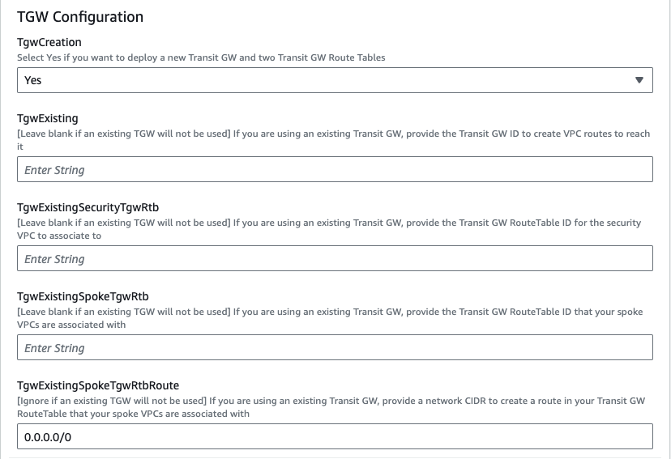

Once the prerequisites have been satisfied proceed with the deployment steps below.

1.  To download the templates, you can either clone the repo with the git command below or [**download**](https://github.com/FortinetCloudCSE/fortigate-aws-gwlb-cloudformation) the repo as a ZIP archive.  The templates themselves are located in the **/cloudformation folder**

	```
	git clone https://github.com/FortinetCloudCSE/fortigate-aws-gwlb-cloudformation.git
	```

	

2.  Login to your AWS account.  In the AWS services page under All Services > Management Tools, select CloudFormation.

	

3.  Select Create Stack then select with new resources.

	

4.  On the Select Template page, under the Specify Template section select Upload a template file to Amazon S3 and browse to your local copy of the chosen deployment template.

	

5.  On the Specify Details page, you will be prompted for a stack name and parameters for the deployment.  We are using the **'SecurityVPC_FGT_GWLB_MultiAZ.template.json'** template which deploys a new VPC, gives options for TGW integration, and deploys multiple FGTs as well.

	
	
	{}We are choosing to deploy TGW so we have set both **'TgwAttach'** and **'TgwCreation'** to **'Yes'** and setting the **tgw route to 0.0.0.0/0 for centralized egress and east/west**.  Note you can also attach to an existing TGW by changing 'TgwCreation' to 'No' and providing the appropriate values for the 'TgwExisting...' parameters.{}

	

6.  In the FortiGate Instance Configuration parameters section, we have selected the number of FGTs per AZ to 2 and Key Pair to use for the FGTs as well as Flex licensing.  Since we are using FLEX licensing, we can leave the InitS3Bucket empty but need to specify the Flex tokens to use.  Then select Next.
	
	{}Since we are deploying 2 FGTs per AZ, we are specifying the first set of Flex tokens for FGT1a and FGT2a in FortiFlexTokensFor1stFgtPerAZ and then the second set for FGT1b and FGT2b in FortiFlexTokensFor2ndFgtPerAZ.{}

	

7.  On the Options page, you can scroll to the bottom and select Next. On the Review page, scroll down to the capabilities section.  As the template will create IAM resources, you need to acknowledge this by checking the box next to ‘I acknowledge that AWS CloudFormation might create IAM resources’ and then click Submit.

	

8.  On the main AWS CloudFormation console, you will now see your stack being created.  You can monitor the progress by selecting your stack and then select the Events tab.

     

9.  Once the stack creation has completed successfully, select the Outputs tab to get the login information for the FGT instances.  If you chose to deploy a new TGW as part of the deployment you will see the IDs of your Transit Gateway and TGW Route Tables.  These will be used as inputs for the **'SpokeVPC_TGW_MultiAZ.template.json'** template.

     
     
     

	 {}We deployed some workload instances in both spoke VPCs to generate traffic flow through the security stack.{}

10.  Select the Outputs tab of the security stack to get the login information for the FGT instances.

     

11.  On the FortiGate GUI navigate to Network > Interfaces, Network > Policy Routes, and run the CLI commands below '\to see the bootstrapped networking config.  **Notice** the GENEVE tunnels are between the FGT port1 interface IP and the private IP of the GWLB node ENI IP.  Also **notice** the priority settings in the static routes and policy routes which allow using the FGTs as Nat GWs for internet bound traffic but to hairpin east/west traffic.

     
     
     
     


12.  After accessing one of the jump box instances, we can use a sniffer command on one or all FGTs to see traffic flow over the GENEVE tunnels to different destinations.  Since the GWLB will hash traffic based on source/dest IPs, Ports, and Protocol, either run the sniffer command on all FGTs or temporarily shutdown all FGTs but one to easily verify traffic flow.

     {}Notice that the FGTs are acting as a Nat GW for internet bound traffic and Source NATing the traffic and routing it out port1, while east/west is hair pinned back to the correct geneve tunnel.{}

     
     
     

13.  This concludes the template deployment example.
